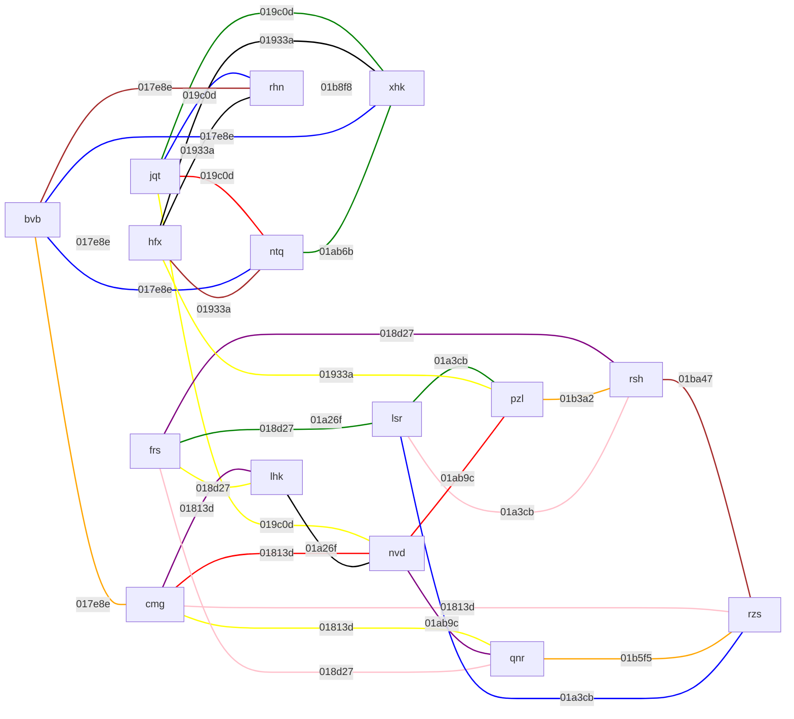

```mermaid
graph LR
  jqt---|019c0d| rhn
  jqt---|019c0d| xhk
  jqt---|019c0d| nvd
  jqt---|019c0d| ntq
  frs---|018d27| rsh
  pzl---|01b3a2| rsh
  lsr---|01a3cb| rsh
  rsh---|01ba47| rzs
  hfx---|01933a| xhk
  rhn---|01b8f8| xhk
  bvb---|017e8e| xhk
  ntq---|01ab6b| xhk
  cmg---|01813d| qnr
  cmg---|01813d| nvd
  cmg---|01813d| lhk
  bvb---|017e8e| cmg
  cmg---|01813d| rzs
  bvb---|017e8e| rhn
  hfx---|01933a| rhn
  bvb---|017e8e| hfx
  bvb---|017e8e| ntq
  lsr---|01a3cb| pzl
  hfx---|01933a| pzl
  nvd---|01ab9c| pzl
  nvd---|01ab9c| qnr
  qnr---|01b5f5| rzs
  frs---|018d27| qnr
  hfx---|01933a| ntq
  lhk---|01a26f| nvd
  lhk---|01a26f| lsr
  lsr---|01a3cb| rzs
  frs---|018d27| lsr
  frs---|018d27| lhk

  linkStyle 0 stroke-width:2px,fill:none,stroke:blue;
  linkStyle 1 stroke-width:2px,fill:none,stroke:green;
  linkStyle 2 stroke-width:2px,fill:none,stroke:yellow;
  linkStyle 3 stroke-width:2px,fill:none,stroke:red;
  linkStyle 4 stroke-width:2px,fill:none,stroke:purple;
  linkStyle 5 stroke-width:2px,fill:none,stroke:orange;
  linkStyle 6 stroke-width:2px,fill:none,stroke:pink;
  linkStyle 7 stroke-width:2px,fill:none,stroke:brown;
  linkStyle 8 stroke-width:2px,fill:none,stroke:black;
  linkStyle 9 stroke-width:2px,fill:none,stroke:white;
  linkStyle 10 stroke-width:2px,fill:none,stroke:blue;
  linkStyle 11 stroke-width:2px,fill:none,stroke:green;
  linkStyle 12 stroke-width:2px,fill:none,stroke:yellow;
  linkStyle 13 stroke-width:2px,fill:none,stroke:red;
  linkStyle 14 stroke-width:2px,fill:none,stroke:purple;
  linkStyle 15 stroke-width:2px,fill:none,stroke:orange;
  linkStyle 16 stroke-width:2px,fill:none,stroke:pink;
  linkStyle 17 stroke-width:2px,fill:none,stroke:brown;
  linkStyle 18 stroke-width:2px,fill:none,stroke:black;
  linkStyle 19 stroke-width:2px,fill:none,stroke:white;
  linkStyle 20 stroke-width:2px,fill:none,stroke:blue;
  linkStyle 21 stroke-width:2px,fill:none,stroke:green;
  linkStyle 22 stroke-width:2px,fill:none,stroke:yellow;
  linkStyle 23 stroke-width:2px,fill:none,stroke:red;
  linkStyle 24 stroke-width:2px,fill:none,stroke:purple;
  linkStyle 25 stroke-width:2px,fill:none,stroke:orange;
  linkStyle 26 stroke-width:2px,fill:none,stroke:pink;
  linkStyle 27 stroke-width:2px,fill:none,stroke:brown;
  linkStyle 28 stroke-width:2px,fill:none,stroke:black;
  linkStyle 29 stroke-width:2px,fill:none,stroke:white;
  linkStyle 30 stroke-width:2px,fill:none,stroke:blue;
  linkStyle 31 stroke-width:2px,fill:none,stroke:green;
  linkStyle 32 stroke-width:2px,fill:none,stroke:yellow;
```